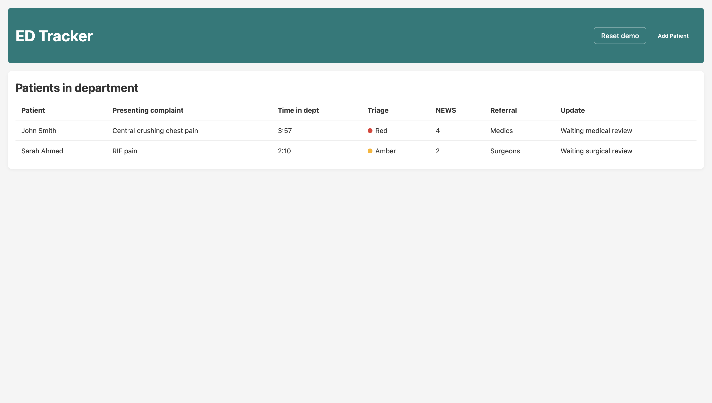
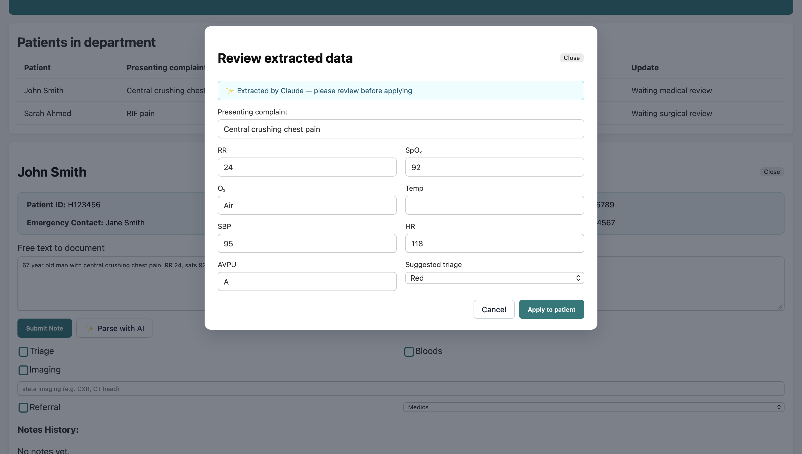
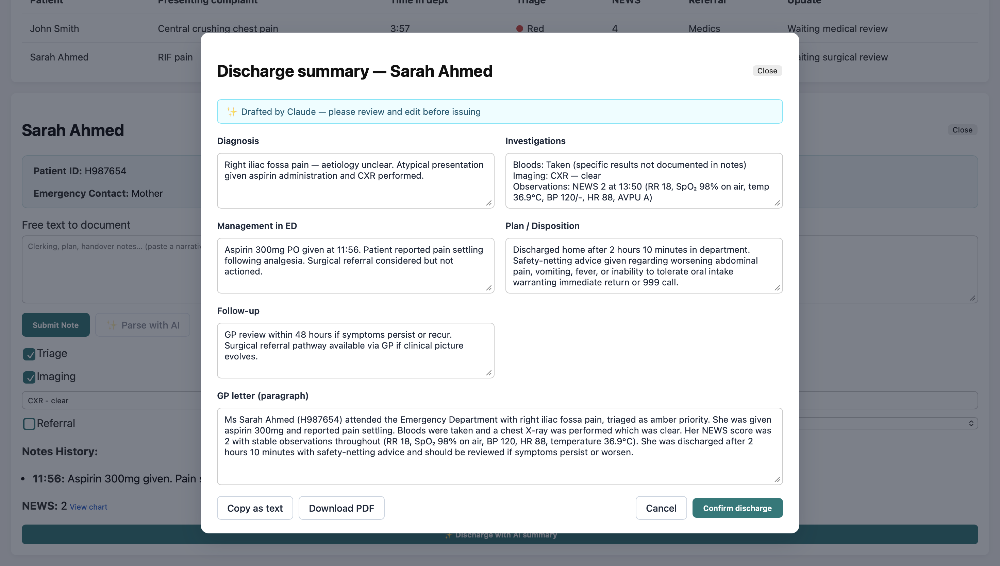

# ED-Tracker — AI-Augmented Emergency Department Patient Tracker

[](https://ed-tracker-seven.vercel.app)
[](https://react.dev)
[](https://vitejs.dev)
[](https://www.anthropic.com/claude)
[](LICENSE)

A doctor-built web app for tracking patients in an Emergency Department, with two genuinely useful AI features powered by Claude:

1. **Free-text → structured form** — paste a clerking narrative, Claude extracts presenting complaint, observations, and triage suggestion into editable fields
2. **AI-generated discharge summaries** — one click produces a complete, editable discharge summary from everything entered during the patient's stay (notes, NEWS history, tasks, imaging, referrals)

**🔗 Live demo:** [ed-tracker-seven.vercel.app](https://ed-tracker-seven.vercel.app)

Built by a foundation doctor who got tired of the friction between writing free-text clerkings and filling in identical structured fields, and of writing the same discharge summary patterns by hand at the end of every shift.

---

## What it does

<p align="center">
  
</p>

The core flow mirrors how UK ED tracker software (EDIS, Symphony, Medway) actually works:

- **Patient table** — name, presenting complaint, time in dept, triage, NEWS, referral, status
- **Click a patient** to open a detail panel with contact / GP info, free-text notes, ED tasks (triage, bloods, imaging, referral), and an expandable **NEWS chart**
- **Add observations** — RR, SpO₂, O₂ device, temp, BP, HR, AVPU. NEWS2 score auto-calculated using the Royal College of Physicians 2017 spec, with **per-patient Scale 1 / Scale 2 toggle** for hypercapnic respiratory failure
- **Discharge** — generates an AI-powered discharge summary the doctor can edit, copy, or download as a PDF

State persists to `localStorage` so the patient list survives refreshes. A **Reset demo** button restores the canonical demo state for portfolio viewers.

---

## The "AI" earns its name

This isn't an `if/else` engine dressed up with marketing. Both AI features are real Claude calls, with thoughtful prompt engineering and a trust-preserving UX (the doctor reviews and edits every AI output before it lands in the record).

### Feature 1 — Parse free-text into structured fields

Paste a narrative clerking. Claude extracts:
- Presenting complaint (concise, headline-style)
- All seven observations (RR, SpO₂, O₂ device, temp, SBP, HR, AVPU)
- A suggested triage band (Red / Amber / Green) per NHS conventions

The result appears in an **editable preview modal** — the doctor reviews and applies, never auto-write. The NEWS form pre-fills so committing the obs takes one click.

<p align="center">
  
</p>

### Feature 2 — AI-generated discharge summaries

Click "Discharge with AI summary." Claude reads the entire patient record (notes chronologically, NEWS history, tasks completed, imaging, referrals) and produces a six-section discharge summary:

- Diagnosis / working differential
- Investigations performed (with results from notes)
- Management in ED
- Plan / disposition
- Follow-up arrangements
- A GP-letter paragraph in third-person prose

Every section is editable. Output options: **copy as text** to paste into the EPR, **download PDF** for the patient pack, or **confirm discharge** to remove the patient from the list.

<p align="center">
  
</p>

This is the feature that would actually save time on a shift. Discharge summaries are the most painful task in real ED practice — this turns them into 30 seconds of review instead of 15 minutes of writing.

---

## Architecture

Browser (React)                     Vercel                          Anthropic[free text input]    ──POST──▶   /api/extract-clerking   ──POST──▶  Claude API
(serverless function)               (sk-ant-... lives here,
│                              never in the bundle)
[parsed obs]        ◀──JSON───        │
reads ANTHROPIC_API_KEY
from Vercel env vars

Two serverless functions handle Claude calls; the React app never sees the API key.

ED-Tracker/
├── api/
│   ├── extract-clerking.js          # narrative → structured JSON
│   └── generate-discharge-summary.js # patient record → discharge document
├── src/
│   ├── App.jsx                       # state orchestrator
│   ├── App.css
│   ├── lib/
│   │   ├── llm.js                    # frontend client for /api endpoints
│   │   └── news.js                   # NEWS2 calculator (Scale 1 + Scale 2)
│   └── components/
│       ├── TopBar.jsx                # header (Add Patient + Reset demo)
│       ├── PatientTable.jsx          # in-department list
│       ├── PatientDetail.jsx         # per-patient panel
│       ├── NewsChart.jsx             # expandable NEWS chart + obs form
│       ├── AddPatientModal.jsx       # new patient form
│       ├── ParsePreviewModal.jsx     # AI extract review modal
│       └── DischargeSummaryModal.jsx # AI discharge review + PDF export
└── assets/
└── screenshots/                  # README images

**Stack:** React 19, Vite 7, plain CSS, jsPDF, `@anthropic-ai/sdk`, Vercel Functions. No backend database, no auth, no patient data ever leaves the user's browser except the narrative paste/discharge generation calls — which go to Claude via Vercel.

---

## NEWS2 — Scale 1 vs Scale 2

A clinical detail worth highlighting because it's where most "NEWS calculator" projects cut corners:

NEWS2 has two scales for SpO₂ scoring:
- **Scale 1** (default adult): target SpO₂ ≥96%
- **Scale 2** (hypercapnic respiratory failure, e.g. severe COPD): target SpO₂ 88-92%

The clinically critical bit: on Scale 2, **breathing supplemental oxygen at SpO₂ ≥93% scores higher than breathing air at the same SpO₂**, because hyperoxygenation in T2RF risks CO₂ retention. The toggle lives on the patient (per-patient clinical decision, not per-observation), and the score recalculates instantly when flipped.

Reference: [RCP NEWS2 (July 2017)](https://www.rcplondon.ac.uk/projects/outputs/national-early-warning-score-news-2)

---

## Run locally

```bash
git clone https://github.com/M-Omarjee/ED-Tracker.git
cd ED-Tracker

npm install

# Add your Anthropic API key (get one at console.anthropic.com)
echo 'ANTHROPIC_API_KEY=sk-ant-...' > .env.local

# Run with full Vercel emulation (serverless functions + frontend)
vercel dev

# Or just the frontend (AI features will return "fallback")
npm run dev
```

For the full AI experience locally you need `vercel dev` so the serverless functions run. The plain `npm run dev` will load the UI but `/api/*` endpoints won't exist.

---

## Limitations and honest scope

- **Demo data only.** The two demo patients (John Smith, Sarah Ahmed) are entirely synthetic. Real ED data would never go in a portfolio app.
- **No backend / no auth.** State persists to `localStorage` only. By design for a portfolio MVP — adding a real backend would be a different project.
- **Single-clinician model.** No handover, no concurrent edits, no audit trail of who did what.
- **No imaging / lab integration.** The "imaging" field is a free-text label — there's no PACS connection or lab result fetching.
- **NEWS2 only.** Doesn't yet support paediatric early warning scores (PEWS) or maternal scores (MEOWS).
- **AI output is a draft, not a clinical decision.** Claude is wrong sometimes. Both AI features show the output in editable preview modals so the doctor reviews before applying. The PDF footer says "please verify before clinical use."

---

## Roadmap

- [ ] Live timer for "time in dept" (currently a static label)
- [ ] Stats banner above the patient table (count, avg wait, high-acuity flags)
- [ ] Triage badges instead of dots (richer visual hierarchy)
- [ ] Notes click-to-expand (currently inline in a flat list)
- [ ] PEWS / MEOWS support
- [ ] Trust-branded discharge PDF (logo upload, header colour)
- [ ] Multi-clinician handover (shift change with notes carry-over)

---

## Author

**Dr Muhammed Omarjee**
Resident Doctor (MBBS, King's College London 2023)
Building practical AI tools for NHS frontline workflows.

Sister projects (live):
- [ECG-Explain](https://github.com/M-Omarjee/ecg-explain) — 12-lead ECG classifier with per-lead Grad-CAM (PTB-XL, AUROC 0.91)
- [Sepsis-AI](https://github.com/M-Omarjee/sepsis-ai) — NEWS2 vs ML benchmark with decision curve analysis and subgroup audit
- [AuditAI](https://github.com/M-Omarjee/Audit-AI) — [Live](https://audit-ai-mo.streamlit.app) — AI-powered clinical audit tool with Claude-generated NICE/RCP-grounded recommendations

---

## License

[MIT](LICENSE)